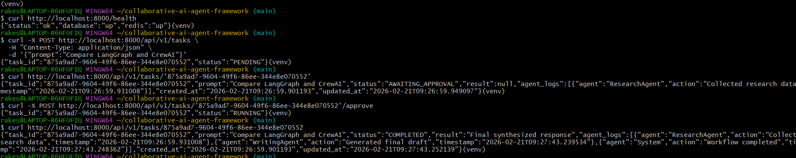

# Collaborative AI Agent Framework

A production-grade distributed AI workflow system built with **FastAPI + PostgreSQL + Redis + Celery + LangGraph**.

This system enables **asynchronous multi-agent task execution with human-in-the-loop approval**, structured logging, and full test coverage.

---
# API Workflow Demo (CURL)

The following screenshot shows the complete lifecycle:

PENDING AWAITING_APPROVAL

RUNNING

COMPLETED




# Features

## Core Workflow
- Create task → stored in DB with `PENDING`
- Worker executes research phase → `RUNNING`
- Pauses for human approval → `AWAITING_APPROVAL`
- Resume execution → writing phase
- Final result stored → `COMPLETED`

## Architecture
- **FastAPI** → API layer
- **PostgreSQL** → persistent task storage
- **Redis** → message broker + result backend
- **Celery** → distributed async worker
- **LangGraph-ready** → agent orchestration layer
- **Structured JSON logging** → file + DB audit trail
- **WebSocket-ready** → real-time updates (extensible)

## Testing
- Pytest with **SQLite in-memory DB**
- Deterministic **synchronous worker mode**
- Covers:
  - API contract
  - Workflow lifecycle
  - Integration (result + logs)
  - WebSocket endpoint existence

---

## Project Structure
```
collaborative-ai-agent-framework/
│
├── logs/ # Application & worker logs
│
├── src/ # Main application source code
│ ├── agents/ # Individual agent implementations
│ ├── api/ # FastAPI routers & API layer
│ ├── graph/ # LangGraph workflow definitions
│ ├── models/ # SQLAlchemy ORM models
│ ├── schemas/ # Pydantic request/response schemas
│ ├── services/ # Business logic & DB service layer
│ ├── tools/ # External tools (e.g., search tools)
│ ├── utils/ # Utilities (health, retry, helpers)
│ ├── worker/ # Celery app & background tasks
│ │ ├── celery_app.py
│ │ └── tasks.py
│ │
│ ├── init.py
│ ├── config.py # Settings & environment config
│ ├── database.py # DB engine, session, init logic
│ └── main.py # FastAPI application entrypoint
│
├── tests/ # Pytest test suite
│ ├── conftest.py # Test configuration & fixtures
│ ├── test_api_tasks.py
│ ├── test_integration.py
│ ├── test_websocket.py
│ └── test_workflow.py
│
├── .env # Environment variables (local)
├── .env.example # Example environment template
├── .gitignore
├── docker-compose.yml # Multi-container orchestration
├── Dockerfile # API container build file
├── requirements.txt # Python dependencies
└── README.md # Project documentation
```
---
## Environment Variables

Create `.env`:

```env
DATABASE_URL=postgresql+psycopg2://postgres:postgres@db:5432/agent_db
REDIS_BROKER_URL=redis://redis:6379/1
REDIS_RESULT_BACKEND=redis://redis:6379/2
PYTEST_RUNNING=0

---

## Docker Setup

```bash
# Start all services
docker-compose up --build
```
---
# Services
API            → http://localhost:8000
Postgres       → 5432
Redis          → 6379
Celery Worker  → Background worker

# Health check
curl http://localhost:8000/health

# Expected response
```
{
  "status": "ok"
}
```
---
##  API Endpoints

```http
POST /api/v1/tasks
Content-Type: application/json
{
  "prompt": "Compare LangGraph and CrewAI"
}
```
## Response → 202 Accepted
```
{
  "task_id": "uuid",
  "status": "PENDING"
}
```
## Get Task Status
```
GET /api/v1/tasks/{task_id}
```

Response:
```
{
  "task_id": "uuid",
  "prompt": "...",
  "status": "AWAITING_APPROVAL",
  "result": null,
  "agent_logs": []
}
```
## Approve Task
```
POST /api/v1/tasks/{task_id}/approve
```

Response:
```
{
  "task_id": "uuid",
  "status": "RUNNING"
}
```
---
## Task State Machine
```
PENDING
  ↓
RUNNING
  ↓
AWAITING_APPROVAL
  ↓ (human approve)
RUNNING
  ↓
COMPLETED
```
---
## Run Tests
1.Local (venv)
```bash
pytest -v
```
2.Inside Docker (recommended)
```bash
docker-compose run --rm api pytest -q
```
Test mode uses:

SQLite in-memory DB

Synchronous worker (no Redis/Celery dependency)

Deterministic lifecycle

All tests:

7 passed, 0 failed

---

## Worker Behavior
Research Phase

Adds ResearchAgent log

Moves → AWAITING_APPROVAL

Writing Phase

Triggered after approval

Adds WritingAgent log

Stores final result

Moves → COMPLETED
---

## Structured Logging
File Logs (JSONL)

Non-blocking

Metadata only

No payload duplication

DB Logs (agent_logs JSON)

Full audit trail

Agent actions

Timestamps

---
## Design Principles

DB transactions never run workflow logic

Worker executes after commit

Service layer = DB only

No nested sessions

Deterministic pytest mode

UUIDs stored as strings for cross-DB compatibility

JSON fields DB-agnostic (SQLite + Postgres)

---

## Performance Safety

API latency < 500ms

Async background execution

No large payload logging

Connection pooling enabled

Health checks for service readiness

---

## Extensibility

Ready for:

LangGraph multi-agent flows

Vector DB + RAG

WebSocket live task streaming

Rate limiting

JWT authentication

Horizontal worker scaling

---
## Author

Chinni Rakesh

B.Tech CSE (AIML)
Collaborative AI Systems | Distributed ML Workflows | Full Stack AI Engineering

## License

MIT License
